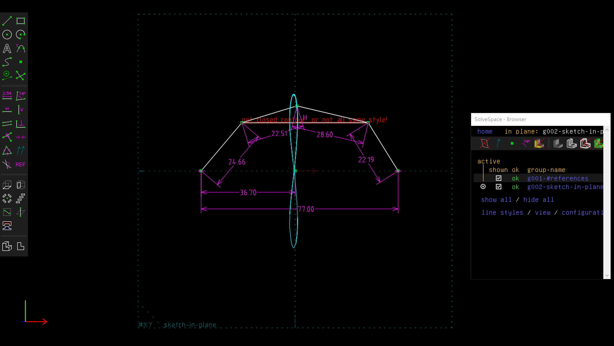

Title: SolveSpace W7
Date: 2016-10-28 12:00
Category: Misc
Tags: 上課內容, 解決問題, 子模組
Author: 40423223

<h2>使用SolveSpace的Trace Point計算路徑<h2>

<iframe src="https://player.vimeo.com/video/199472879" width="640" height="361" frameborder="0" webkitallowfullscreen mozallowfullscreen allowfullscreen></iframe>

<a href="https://vimeo.com/199472879">40423203</a> from <a href="https://vimeo.com/user46241007">40423203</a> on <a href="https://vimeo.com">Vimeo</a>.

