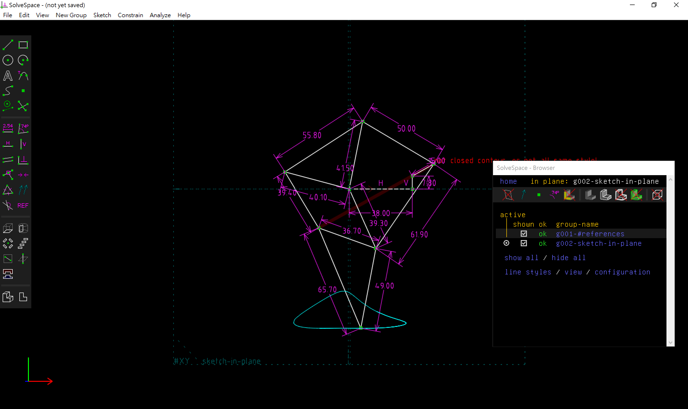
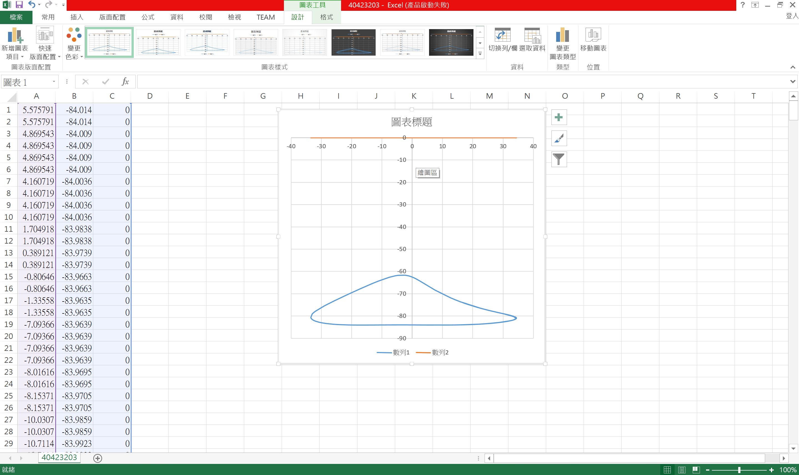

Title:  四連桿運動模擬 w15 :
Date: 2016-12-30 12:00
Category: Misc
Tags: 上課內容, OnShape, SolveSpace
Author: 40423201

<iframe src="https://player.vimeo.com/video/196765161" width="640" height="381" frameborder="0" webkitallowfullscreen mozallowfullscreen allowfullscreen></iframe>

<a href="https://vimeo.com/196765161">40423203Linkages (fourbar &amp; multilink) (四連桿與多連桿運動模擬)</a> from <a href="https://vimeo.com/user46241007">40423203</a> on <a href="https://vimeo.com">Vimeo</a>.

		

		

將所得到的點座標 .csv 以 Excel 畫圖, 得到:
  
	       

